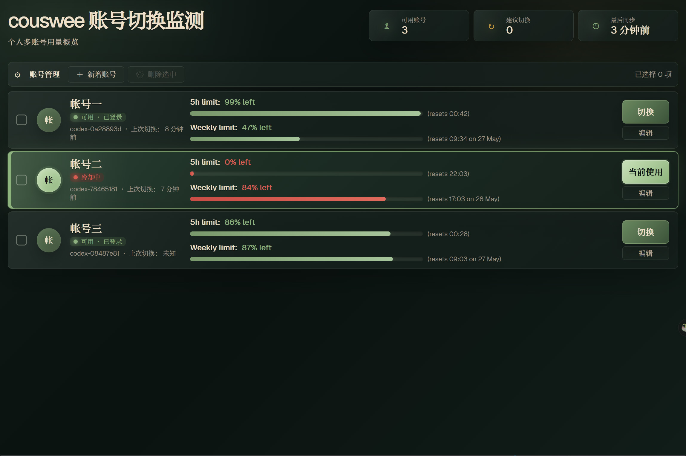

# couswee

couswee 是一个本地运行的 Codex 多账号切换与剩余流量监测面板。它用 SQLite 管理账号元数据，通过切换账号时替换当前用户的 `~/.codex/auth.json` 来切换 Codex CLI 当前账号，并把 5h / weekly 限额按“剩余流量”语义展示在账号列表中。

每个账号的 `auth.json` 都是单独文件管理的：通过 couswee 登录生成的账号会保存到 `~/.couswee/profiles/<profile>/auth.json`；手动导入的账号会保留原认证文件路径。SQLite 只记录账号元数据和认证文件路径，不把多个账号合并进同一个认证文件。切换账号时，couswee 才会把目标账号对应的认证文件复制到 `~/.codex/auth.json`，作为 Codex CLI 当前活跃账号。



## 功能概览

- 多账号管理：新增、编辑、删除、选择账号，账号数据存储在 `~/.couswee/couswee.db`。
- Codex 登录：从网页界面启动 `codex login --device-auth`，轮询登录会话状态，成功后写入受管账号配置。
- 手动导入：兼容已有认证文件路径，导入后仍写入 SQLite，不再维护旧 JSON 注册表。
- 一键切换：按账号 `profile_name` 或 `id` 选择目标账号，将对应认证文件复制到 `~/.codex/auth.json`；`nickname` 只作为界面显示标签。
- 剩余流量监测：对每个账号读取认证令牌，查询 Codex / ChatGPT 用量接口，并展示 5h / weekly 的剩余百分比与重置时间。
- 本地 API：GoFiber 提供账号、登录、切换、用量、健康检查和版本查询接口。
- SvelteKit 前端：紧凑暗色仪表盘，账号列表内联展示剩余流量、状态、编辑和切换操作。
- 发布产物：Release 包包含已嵌入前端静态文件的 `couswee` 单二进制，解压后可直接运行。

## 架构

```text
web/src/routes/+page.svelte
        |
        | JSON 接口
        v
internal/server        GoFiber 路由与静态文件服务
        |
        +-- internal/accounts   SQLite 账号存储、认证切换、登录会话
        +-- internal/usage      用量采集、缓存、刷新服务
        +-- internal/version    运行时版本元数据
```

主要入口：

- `cmd/couswee/main.go`：启动本地服务、初始化账号存储、启动用量刷新服务。
- `internal/server/server.go`：注册 `/api/*` 路由并服务前端静态文件。
- `internal/accounts/`：账号模型、SQLite 存储、Codex 登录、受管账号配置、认证切换。
- `internal/usage/`：API 采集器、备用命令采集器、会话日志兜底、内存缓存和持久化。
- `web/src/routes/+page.svelte`：账号管理、登录流程、选择/删除/编辑、剩余流量 UI。

## 快速开始

从 GitHub Release 下载 Linux amd64 发布包和 sha256 校验文件：

```bash
couswee-v0.1.0-linux-amd64.tar.gz
couswee-v0.1.0-linux-amd64.tar.gz.sha256
```

校验下载文件：

```bash
sha256sum -c couswee-v0.1.0-linux-amd64.tar.gz.sha256
```

解压并进入目录：

```bash
mkdir -p couswee-v0.1.0
tar -C couswee-v0.1.0 -xzf couswee-v0.1.0-linux-amd64.tar.gz
cd couswee-v0.1.0
```

运行：

```bash
./couswee
```

打开：

```text
http://<本机局域网 IP>:2199
```

Release 包内的 `couswee` 已嵌入 `web/dist` 前端静态文件，默认即可服务前端。默认监听 `0.0.0.0:2199`，同一局域网内可访问。需要改监听地址时设置 `COUSWEE_ADDR`，例如仅允许本机访问：`COUSWEE_ADDR=127.0.0.1:2199 ./couswee`。

## 数据与安全边界

couswee 默认在同一可信局域网内提供 Web 访问，数据仍保存在运行 couswee 的本机，默认位置如下：

| 路径 | 用途 |
| --- | --- |
| `~/.couswee/couswee.db` | SQLite 主数据库，保存账号元数据、用量快照、登录会话 |
| `~/.couswee/profiles/<profile>/auth.json` | 通过 couswee 登录生成的受管认证文件 |
| `~/.couswee/login-sessions/<id>/home` | 临时 Codex 登录 HOME |
| `~/.codex/auth.json` | Codex CLI 当前活跃账号，切换账号时被替换 |

注意：

- 认证令牌不会返回给前端。
- 网页界面手动导入认证文件时只记录路径和元数据。
- 切换账号时会复制目标认证文件到 `~/.codex/auth.json`。
- 删除 couswee 管理的账号配置时，只删除 `~/.couswee/profiles/` 下的受管目录，避免误删外部认证文件。

## 账号工作流

### Codex 登录

1. 在页面点击 `新增账号`。
2. 选择 `Codex 登录`。
3. couswee 启动 `codex login --device-auth`，读取验证 URL 和用户 code。
4. 授权成功后，认证 JSON 写入 `~/.couswee/profiles/<profile>/auth.json`。
5. 新账号写入 SQLite，并可在面板中切换。

### 手动导入

1. 在页面点击 `新增账号`。
2. 打开 `手动导入`。
3. 填写昵称、认证文件路径和可选订阅/备注。
4. 保存后账号进入 SQLite，但原认证文件仍保留在原位置。

### 切换账号

点击账号卡片的 `切换` 按钮后，后端会：

1. 按 `profile_name` 或 `id` 查找账号。
2. 将该账号的认证文件复制到 `~/.codex/auth.json`。
3. 更新 SQLite 中的 active 状态和 `last_used_at`。
4. 刷新该账号的用量记录。

## API

所有接口默认服务在 `http://<本机局域网 IP>:2199`。

| 方法 | 路径 | 说明 |
| --- | --- | --- |
| `GET` | `/api/accounts` | 返回 SQLite 中的账号列表，会同步当前 `~/.codex/auth.json` 对应的激活状态 |
| `POST` | `/api/accounts` | 手动导入账号，必填 `nickname` 和 `auth_path` |
| `PATCH` | `/api/accounts/:id` | 编辑账号昵称、订阅/备注、状态等非敏感元数据 |
| `DELETE` | `/api/accounts` | 按 `profile_names` 或 `ids` 批量删除账号 |
| `GET` | `/api/current` | 返回当前激活账号，没有激活账号时返回 404 |
| `POST` | `/api/switch` | 按 `{ "profile_name": "..." }` 或 `{ "id": "..." }` 切换账号 |
| `POST` | `/api/codex/login/start` | 启动 Codex 设备码登录 |
| `POST` | `/api/codex/login/oauth/start` | 兼容别名，行为同 `/api/codex/login/start` |
| `POST` | `/api/codex/login/device/start` | 兼容别名，行为同 `/api/codex/login/start` |
| `GET` | `/api/codex/login/:session_id` | 查询登录会话状态 |
| `POST` | `/api/codex/login/:session_id/cancel` | 取消登录会话 |
| `GET` | `/api/codex/usage` | 返回每个账号的 Codex 剩余流量记录 |
| `GET` | `/api/version` | 返回运行版本、提交号和构建时间 |
| `GET` | `/api/health` | 健康检查 |

手动导入账号示例：

```bash
BASE_URL=http://<本机局域网 IP>:2199

curl -X POST "$BASE_URL/api/accounts" \
  -H 'Content-Type: application/json' \
  -d '{"nickname":"main","auth_path":"~/.codex-auth/main.json","subscription":"pro"}'
```

切换账号示例：

```bash
curl -X POST "$BASE_URL/api/switch" \
  -H 'Content-Type: application/json' \
  -d '{"profile_name":"main"}'
```

版本查询示例：

```bash
curl "$BASE_URL/api/version"
```

## Codex 剩余流量监测

couswee 将用量数据合并进账号列表，同时也通过 `/api/codex/usage` 暴露独立记录。

```bash
curl "$BASE_URL/api/codex/usage"
```

示例响应：

```json
[
  {
    "account": "main",
    "5h_usage": 65,
    "weekly_usage": 42,
    "5h_remaining": 65,
    "weekly_remaining": 42,
    "reset_time": "2026-05-14T00:00:00Z",
    "5h_reset_time": "2026-05-14T00:00:00Z",
    "weekly_reset_time": "2026-05-17T14:55:35Z",
    "usage_basis": "remaining",
    "unit": "percent",
    "source": "api",
    "last_refresh": "2026-05-13T15:00:00Z",
    "stale": false,
    "error": ""
  }
]
```

字段语义：

- `5h_remaining` / `weekly_remaining` 是剩余百分比。
- 兼容字段 `5h_usage` / `weekly_usage` 目前也承载剩余百分比，`usage_basis` 固定表达为 `remaining`。
- `source` 表示来源，可能是 `api`、`fallback`、`codex-session`、`account` 或 `error`。
- `stale: true` 表示当前记录来自旧缓存或账号内保存的上次成功值。

### 采集顺序

1. API 采集器：读取账号认证文件中的 `tokens.access_token`，请求 `COUSWEE_USAGE_API_URL`。
2. 备用命令：如果设置了 `COUSWEE_USAGE_FALLBACK_CMD`，失败时执行本地命令。
3. 会话日志兜底：如果设置了 `COUSWEE_USAGE_SESSION_GLOB`，解析 Codex CLI 会话日志中的 `payload.rate_limits`。
4. 账号记录兜底：以上都失败时，使用 SQLite 中保存的上次成功百分比，并标记为过期数据。

对于 Codex 限额载荷，couswee 会把 `used_percent` / `used_percentage` 转换为 `100 - used`，保持和 Codex CLI “剩余”一致的语义。

### 用量环境变量

| 变量 | 默认值 | 说明 |
| --- | --- | --- |
| `COUSWEE_USAGE_REFRESH_INTERVAL` | `5m` | 用量刷新间隔，实际值会被限制在 1-5 分钟 |
| `COUSWEE_USAGE_UNIT` | `percent` | 用量单位标签，前端按百分比展示 |
| `COUSWEE_USAGE_API_ENABLED` | `true` | 是否启用 API 采集器 |
| `COUSWEE_USAGE_API_URL` | `https://chatgpt.com/backend-api/wham/usage` | 用量 / 限额接口 |
| `COUSWEE_USAGE_SESSION_GLOB` | 空 | 可选 Codex 会话日志兜底，例如 `~/.codex/sessions/**/*.jsonl` |
| `COUSWEE_USAGE_FALLBACK_CMD` | 空 | 可选本地备用命令，后端会追加账号昵称和认证文件路径参数 |
| `COUSWEE_USAGE_FALLBACK_TIMEOUT` | `20s` | 备用命令超时时间 |

备用命令应输出单个用量 JSON、用量 JSON 数组，或 abtop / Codex 限额风格对象。

最小示例：

```json
{"account":"main","5h_usage":69,"weekly_usage":11,"5h_remaining":69,"weekly_remaining":11,"usage_basis":"remaining","unit":"percent"}
```

## 开发

开发编译需要 Go、Node.js 与 npm。可选安装 Codex CLI，用于网页界面中的设备码登录流程。

常用命令：

```bash
npm install
npm run build
npm run go:run
npm test -- --run
go test ./...
```

`npm run go:run` 会使用本项目的 `.cache/` 作为 Go 缓存和 GOPATH，便于本地隔离。

只跑后端：

```bash
COUSWEE_STATIC_DIR=web/dist go run ./cmd/couswee
```

## 验证

如需验证发布包：

```bash
make package VERSION=v0.1.0-test
./dist/couswee --version
sha256sum -c dist/couswee-v0.1.0-test-linux-amd64.tar.gz.sha256
```
